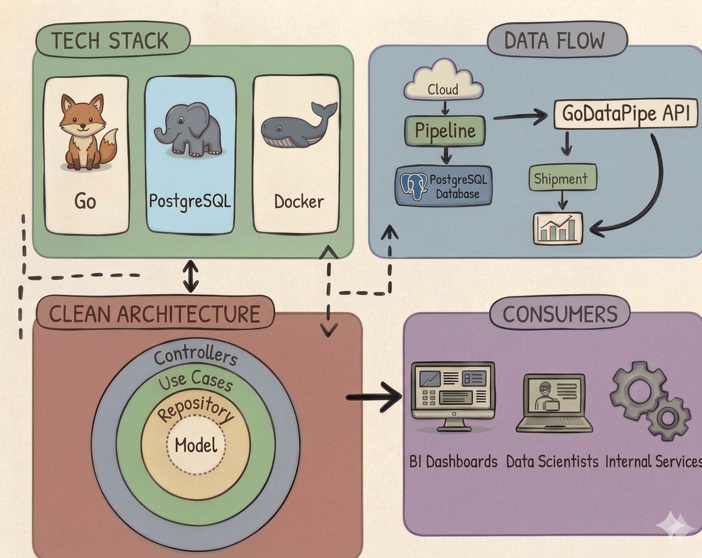

# GoDataPipe

**A RESTful API built with Go and Clean Architecture that serves curated logistics data — shipments, routes, fleet metrics, and delivery performance — ready for consumption by analytics teams, dashboards, and downstream services.**



---

## Description

GoDataPipe is the **data-serving layer** for a logistics operation. It sits between your data pipelines (Airflow, dbt, Spark) and the people who need the data: analysts building dashboards, data scientists optimizing routes, and BI teams tracking delivery KPIs.

Instead of giving everyone direct database access, GoDataPipe exposes clean, paginated, filterable REST endpoints over curated logistics data.

**Who consumes this API?**
- Operations analysts tracking shipment performance in Metabase or Grafana
- Data Scientists building route optimization or demand forecasting models
- BI teams reporting delivery SLAs and fleet utilization to leadership
- Internal microservices that need logistics data (billing, notifications, ERPs)

---

## Tech Stack

| Technology | Role |
|------------|------|
| **Go** | Core language — fast, compiled, low memory, ideal for high-throughput APIs |
| **PostgreSQL** | Analytical data store for curated logistics tables and views |
| **Docker** | Containerization for the app and the database |
| **Docker Compose** | Multi-container orchestration for local development |

---

## Architecture

Clean Architecture with four concentric layers. Dependencies always point inward.

```
Controllers  →  Use Cases  →  Repository  →  Model
   (outer)                                   (inner)
```

**Model** — Domain entities: `Shipment`, `Route`, `Warehouse`, `FleetVehicle`, `DeliveryEvent`. Pure structs, zero dependencies.

**Repository** — Interfaces + PostgreSQL implementations. This is where the SQL lives: queries over shipment tables, route views, aggregated metrics.

**Use Cases** — Business logic: filter shipments by date range and status, calculate on-time delivery rates, paginate large result sets, aggregate fleet utilization.

**Controllers** — HTTP handlers. Parse query params, call use cases, return standardized JSON. This is what the outside world hits.

---

## API Endpoints — What They Return and Why

### Shipments (`/api/v1/shipments`)

Shipments are the core entity. Each record represents a package or cargo moving from origin to destination.

| Method   | Endpoint                          | What it does |
|----------|-----------------------------------|--------------|
| `GET`    | `/api/v1/shipments`               | Returns a paginated list of shipments with filters. An analyst uses this to pull all shipments from the last 30 days in "delayed" status to investigate bottlenecks. |
| `GET`    | `/api/v1/shipments/:id`           | Returns full detail of one shipment: origin, destination, carrier, status, timestamps, weight, cost. A dashboard widget uses this to show real-time shipment detail. |
| `GET`    | `/api/v1/shipments/:id/events`    | Returns the tracking event history for a shipment: picked up, in transit, at hub, out for delivery, delivered. Useful for building shipment timeline visualizations. |
| `POST`   | `/api/v1/shipments`               | Registers a new shipment record. Used by the ingestion pipeline or internal systems to push new shipment data into the curated store. |
| `PUT`    | `/api/v1/shipments/:id`           | Full update of a shipment record (e.g., correcting origin/destination after a data quality fix). |
| `PATCH`  | `/api/v1/shipments/:id`           | Partial update — typically used to update just the status or delivery timestamp. |
| `DELETE` | `/api/v1/shipments/:id`           | Soft-delete a shipment record (marks as inactive, doesn't destroy data). |

**Example response — `GET /api/v1/shipments?status=delivered&date_from=2025-01-01&limit=2`:**

```json
{
  "status": "success",
  "data": [
    {
      "id": "SHP-20250115-00342",
      "origin": "São Paulo Distribution Center",
      "destination": "Curitiba Hub",
      "carrier": "TransLog BR",
      "status": "delivered",
      "weight_kg": 1250.5,
      "cost_brl": 3420.00,
      "shipped_at": "2025-01-15T08:30:00Z",
      "delivered_at": "2025-01-17T14:22:00Z",
      "sla_met": true
    },
    {
      "id": "SHP-20250116-00587",
      "origin": "Campinas Warehouse",
      "destination": "Rio de Janeiro Terminal",
      "carrier": "RodoExpress",
      "status": "delivered",
      "weight_kg": 780.0,
      "cost_brl": 2150.00,
      "shipped_at": "2025-01-16T06:00:00Z",
      "delivered_at": "2025-01-18T11:45:00Z",
      "sla_met": false
    }
  ],
  "meta": {
    "page": 1,
    "limit": 2,
    "total": 1847
  }
}
```

---

### Routes (`/api/v1/routes`)

Routes represent the paths between logistics hubs. Each route has distance, average time, cost, and performance data.

| Method   | Endpoint                    | What it does |
|----------|-----------------------------|--------------|
| `GET`    | `/api/v1/routes`            | List all active routes with their avg delivery time and cost. A data scientist uses this to feed a route optimization model. |
| `GET`    | `/api/v1/routes/:id`        | Detail of a specific route including historical performance stats. |
| `POST`   | `/api/v1/routes`            | Register a new route (e.g., when the company opens a new corridor). |
| `PUT`    | `/api/v1/routes/:id`        | Update route information (distance, estimated time). |
| `DELETE` | `/api/v1/routes/:id`        | Deactivate a route. |

**Example response — `GET /api/v1/routes/:id`:**

```json
{
  "status": "success",
  "data": {
    "id": "RTE-SP-CWB",
    "origin_hub": "São Paulo DC",
    "destination_hub": "Curitiba Hub",
    "distance_km": 408,
    "avg_transit_hours": 9.5,
    "avg_cost_brl": 3200.00,
    "on_time_rate": 0.87,
    "total_shipments_30d": 342,
    "active": true
  }
}
```

---

### Metrics (`/api/v1/metrics`)

Pre-computed KPIs that leadership and BI teams consume in dashboards. These are aggregated values, not raw data.

| Method   | Endpoint                    | What it does |
|----------|-----------------------------|--------------|
| `GET`    | `/api/v1/metrics`           | Returns all available KPIs with their current values. A Grafana dashboard polls this every 5 minutes to update panels. |
| `GET`    | `/api/v1/metrics/:key`      | Returns a specific metric by key (e.g., `on_time_delivery_rate`). |
| `POST`   | `/api/v1/metrics`           | Define a new metric (used by the data team to register new KPIs). |
| `PUT`    | `/api/v1/metrics/:key`      | Update a metric definition or recalculated value. |
| `DELETE` | `/api/v1/metrics/:key`      | Remove a deprecated metric. |

**Example response — `GET /api/v1/metrics`:**

```json
{
  "status": "success",
  "data": [
    {
      "key": "on_time_delivery_rate",
      "label": "On-Time Delivery Rate",
      "value": 0.874,
      "unit": "percentage",
      "period": "last_30_days",
      "updated_at": "2025-03-15T06:00:00Z"
    },
    {
      "key": "avg_delivery_time_hours",
      "label": "Average Delivery Time",
      "value": 18.3,
      "unit": "hours",
      "period": "last_30_days",
      "updated_at": "2025-03-15T06:00:00Z"
    },
    {
      "key": "cost_per_shipment_brl",
      "label": "Average Cost per Shipment",
      "value": 2875.50,
      "unit": "BRL",
      "period": "last_30_days",
      "updated_at": "2025-03-15T06:00:00Z"
    },
    {
      "key": "fleet_utilization_rate",
      "label": "Fleet Utilization",
      "value": 0.72,
      "unit": "percentage",
      "period": "current",
      "updated_at": "2025-03-15T06:00:00Z"
    },
    {
      "key": "delayed_shipments_count",
      "label": "Delayed Shipments (active)",
      "value": 47,
      "unit": "count",
      "period": "current",
      "updated_at": "2025-03-15T06:00:00Z"
    }
  ]
}
```

---

### Warehouses (`/api/v1/warehouses`)

Data about distribution centers and hubs in the logistics network.

| Method   | Endpoint                              | What it does |
|----------|---------------------------------------|--------------|
| `GET`    | `/api/v1/warehouses`                  | List all warehouses with capacity and current occupancy. |
| `GET`    | `/api/v1/warehouses/:id`              | Detail of a warehouse: location, capacity, throughput. |
| `GET`    | `/api/v1/warehouses/:id/shipments`    | All shipments currently at or routed through this warehouse. |
| `POST`   | `/api/v1/warehouses`                  | Register a new warehouse/hub. |
| `PUT`    | `/api/v1/warehouses/:id`              | Update warehouse info. |
| `DELETE` | `/api/v1/warehouses/:id`              | Deactivate a warehouse. |

---

### Query Parameters (all GET endpoints)

| Parameter    | Example                       | Description                    |
|--------------|-------------------------------|--------------------------------|
| `page`       | `?page=2`                     | Page number                    |
| `limit`      | `?limit=50`                   | Records per page (default: 20) |
| `date_from`  | `?date_from=2025-01-01`       | Filter from date               |
| `date_to`    | `?date_to=2025-03-31`        | Filter to date                 |
| `status`     | `?status=in_transit`          | Filter by status               |
| `carrier`    | `?carrier=TransLog`           | Filter by carrier name         |
| `sort_by`    | `?sort_by=shipped_at`         | Sort field                     |
| `order`      | `?order=desc`                 | Sort direction (asc/desc)      |

---

## Project Structure

```
godatapipe/
├── cmd/
│   └── api/
│       └── main.go                    # Entry point
├── internal/
│   ├── model/                         # Domain entities
│   │   ├── shipment.go
│   │   ├── route.go
│   │   ├── warehouse.go
│   │   ├── metric.go
│   │   └── delivery_event.go
│   ├── repository/                    # Data access layer
│   │   ├── interfaces.go
│   │   └── postgres/
│   │       ├── shipment_repository.go
│   │       ├── route_repository.go
│   │       ├── warehouse_repository.go
│   │       └── metric_repository.go
│   ├── usecase/                       # Business logic
│   │   ├── shipment_usecase.go
│   │   ├── route_usecase.go
│   │   ├── warehouse_usecase.go
│   │   └── metric_usecase.go
│   └── controller/                    # HTTP handlers
│       ├── shipment_controller.go
│       ├── route_controller.go
│       ├── warehouse_controller.go
│       └── metric_controller.go
├── pkg/
│   ├── config/
│   │   └── config.go
│   ├── database/
│   │   └── postgres.go
│   └── response/
│       └── json.go
├── migrations/
│   ├── 001_create_shipments.up.sql
│   ├── 001_create_shipments.down.sql
│   ├── 002_create_routes.up.sql
│   ├── 002_create_routes.down.sql
│   ├── 003_create_warehouses.up.sql
│   ├── 003_create_warehouses.down.sql
│   ├── 004_create_metrics.up.sql
│   └── 004_create_metrics.down.sql
├── images/
│   └── godatapipe-overview.png
├── docker-compose.yml
├── Dockerfile
├── go.mod
├── go.sum
├── .env.example
├── Makefile
└── README.md
```

---

## Environment Variables

```env
# Server
APP_PORT=8080
APP_ENV=development

# Database
DB_HOST=localhost
DB_PORT=5432
DB_USER=godatapipe
DB_PASSWORD=your_secure_password
DB_NAME=godatapipe_db
DB_SSLMODE=disable

# Pagination
DEFAULT_PAGE_LIMIT=20
MAX_PAGE_LIMIT=500
```

---

## Local Setup

### Prerequisites

- **Go** 1.22+
- **Docker & Docker Compose**
- **Make** (optional)

### Quick Start

```bash
# 1. Clone
git clone https://github.com/your-username/godatapipe.git
cd godatapipe

# 2. Init Go module
go mod init github.com/your-username/godatapipe
go mod tidy

# 3. Start PostgreSQL
docker compose up -d postgres

# 4. Run migrations
make migrate-up

# 5. Run the API
go run cmd/api/main.go
# → http://localhost:8080

# Or run everything in Docker
docker compose up --build
```

---

## Makefile Commands

```makefile
make run             # Run the API locally
make build           # Compile the binary
make docker-up       # Start all containers
make docker-down     # Stop all containers
make migrate-up      # Apply migrations
make migrate-down    # Rollback migrations
make test            # Run all tests
make lint            # Run golangci-lint
```

---

## Recommended Go Libraries

| Purpose | Library |
|---------|---------|
| HTTP Router | `github.com/go-chi/chi/v5` |
| PostgreSQL Driver | `github.com/jackc/pgx/v5` |
| Migrations | `github.com/golang-migrate/migrate/v4` |
| Configuration | `github.com/spf13/viper` |
| Validation | `github.com/go-playground/validator/v10` |
| Logging | `log/slog` (stdlib) |
| Testing | `github.com/stretchr/testify` |

---

## License

MIT
